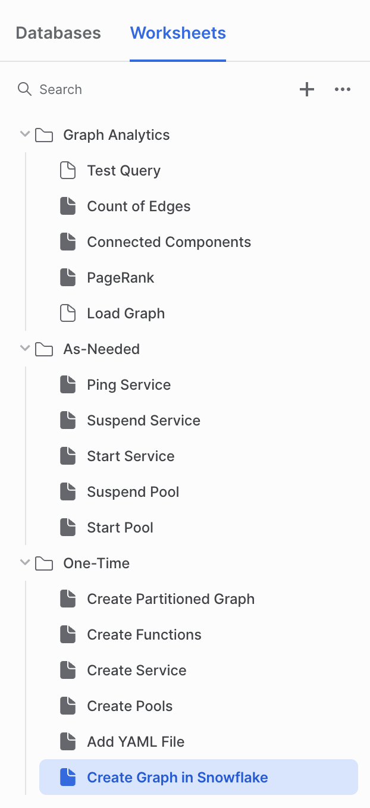

# rai_sfcs_demo
Relational AI and Snowflake Container Services Demo


### Instructions:


Follow along with the snowpark containers [tutorial 1](https://docs.snowflake.com/en/LIMITEDACCESS/snowpark-containers/tutorials/tutorial-1), altering the instructions to use the RAI images.


Edit `rai_service_spec.yaml` file by changing the locations of the rai-server and rai-proxy docker image locations:

	<db>/<schema>/rai_repository/rai-proxy:latest
	<db>/<schema>/rai_repository/rai-server:latest
	<db>/<schema>/rai_repository/snowflake-helper:release
	<db>/<schema>/rai_repository/consul:amd-1.16
	<db>/<schema>/rai_repository/dd-agent:7.38.1
	
Edit `one_time/add_yaml_file.sql` by replacing the physical location of the yaml files:

	put file:///Users/max/demo/rai_service_spec.yaml
	put file:///Users/max/demo/engineconfig.yaml
	put file:///Users/max/demo/ddconfig.yaml

Docker Commands:

You can use the SHOW IMAGE REPOSITORIES SQL command to get the repository URL, use that instead of xxxxxxx.registry.snowflakecomputing.com/demo/data_schema/demo_repository/

	# pull the images
	docker pull maxdemarzi/consul:amd-1.16
	docker pull maxdemarzi/snowflake-helper:release
	docker pull maxdemarzi/rai-server:latest
	docker pull maxdemarzi/dd-agent:7.38.1
	docker pull maxdemarzi/rai-proxy:latest


	# tag the images with your registry
	docker tag maxdemarzi/consul:amd-1.16 xxxxxxx.registry.snowflakecomputing.com/demo/data_schema/demo_repository/consul:amd-1.16
	docker tag maxdemarzi/snowflake-helper:release xxxxxxx.registry.snowflakecomputing.com/demo/data_schema/demo_repository/snowflake-helper:release
	docker tag maxdemarzi/rai-server:latest xxxxxxx.registry.snowflakecomputing.com/demo/data_schema/demo_repository/rai-server:latest
	docker tag maxdemarzi/dd-agent:7.38.1 xxxxxxx.registry.snowflakecomputing.com/demo/data_schema/demo_repository/dd-agent:7.38.1
	docker tag maxdemarzi/rai-proxy:latest xxxxxxx.registry.snowflakecomputing.com/demo/data_schema/demo_repository/rai-proxy:latest


Login to the docker registry (modify registry url and Snowflake username):

	docker login xxxxxxx.registry.snowflakecomputing.com -u <username>

Push the images:

	docker push xxxxxxx.registry.snowflakecomputing.com/demo/data_schema/demo_repository/consul:amd-1.16
	docker push xxxxxxx.registry.snowflakecomputing.com/demo/data_schema/demo_repository/snowflake-helper:release
	docker push xxxxxxx.registry.snowflakecomputing.com/demo/data_schema/demo_repository/rai-server:latest
	docker push xxxxxxx.registry.snowflakecomputing.com/demo/data_schema/demo_repository/dd-agent:7.38.1
	docker push xxxxxxx.registry.snowflakecomputing.com/demo/data_schema/demo_repository/rai-proxy:latest
			

Steps:

1. Go through the example setup.sql and see if you still need to run any variations of these commands.
2. After modifying the yaml file, edit and run the one_time/add_yaml_file.sql
3. In the one_time directory create the pools, service, dd_api_key, functions, graph and partitioned graph.
4. In the as_needed directory, run the ping command to see it is working.
5. In the graph_analytics directory, run the test query.
6. Run the load graph command, then count of edges, pagerank and connected components.

Worksheets should look something like this:



### Telemetry:

This app includes an optional configuration for sending relational.ai telemetry on the service

	to enable data collection change the api key `one_time/create_service.sql`
	PASSWORD = "disabled"
	change `disabled` to your api key (provided by rai)

Upload a config file to the service:

	PUT file:///Users/max/demo/one_time/ddconfig.yaml @rai_yaml_stage/datadog auto_compress=false overwrite=true;

### Troublshooting:

There is a 10 second delay for the rai-service to be available, you will see this message until its ready:
	
	"Post \"http://localhost:8010/transactions\": dial tcp [::1]:8010: connect: connection refused"

Show service status
```sql 
SELECT SYSTEM$GET_SERVICE_STATUS('rai_service',0);
```

Show container logs :
```sql 
CALL SYSTEM$GET_SERVICE_LOGS('<db>.<schema>.<container>', <instance id>, <container name>, <log lines>);

e.g.
CALL SYSTEM$GET_SERVICE_LOGS('demo_database.tpcds.rai-server', '0', 'rai-server', 1000);
CALL SYSTEM$GET_SERVICE_LOGS('demo_database.tpcds.rai-server', '0', 'rai-proxy', 1000);
```
